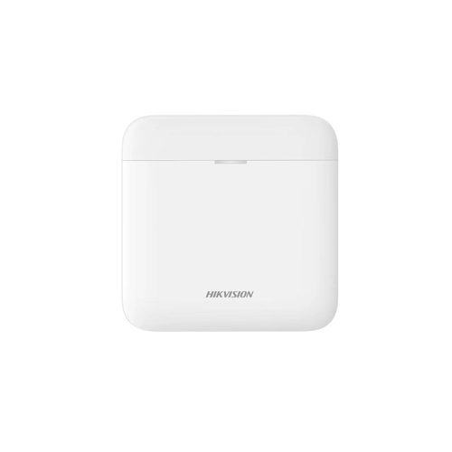

<p align="center">
  
</p>

<h1 align="center">Hikvision AX PRO — Homey App</h1>

<p align="center">
  Local control and monitoring for <b>Hikvision AX PRO</b> wireless alarm systems, directly from Homey Pro.<br>
  No cloud, no bridge — the app talks to your panel over your LAN.
</p>

<p align="center"><i>Built with ❤️ by Ulf Holmström</i></p>

---

## What it does

This app connects Homey Pro to a Hikvision **AX PRO** wireless alarm panel (DS-PWA96 / DS-PWA64 family) over the local network using the panel's ISAPI interface. It automatically discovers your panel, detectors and peripherals and creates them as real Homey devices — so your alarm sensors show up alongside the rest of your smart home, ready for the dashboard, Insights and Flows.

Everything runs **locally on the Homey** — there is no cloud dependency and no separate bridge to maintain.

## Features

- 🔎 **Auto-discovery** — connect once with the panel IP + login; the app lists the panel and every enrolled detector/peripheral to add.
- 🎛️ **Alarm panel** — arm (away), arm stay (partial) and disarm straight from Homey, plus current arm state.
- 🌡️ **Per-detector sensors** — temperature, battery level and tamper for every detector that reports them.
- 🚪🚶🔥 **Correct sensor type per detector** — motion, door/contact, smoke, glass-break, water leak, CO, gas, heat and panic are each mapped to the right Homey alarm capability, with a distinct icon.
- 🧩 **Peripherals** — wireless keypads, external sirens, repeaters, card readers and relay/output modules.
- ♻️ **Shared connection** — all Homey devices for a panel share a single, reused login session (kind to the panel — it never gets flooded with logins).
- 🌍 **Multilingual** — English, Svenska, Nederlands, Deutsch, Français (adapts to your Homey's language).
- 🔒 **Local only** — direct LAN/ISAPI communication, credentials stay on your Homey.

## Supported hardware

**Control panels**

| Model | Notes |
|-------|-------|
| DS-PWA96-M-WE / M2-WE / M2H-WE (Ultra) | Full support |
| DS-PWA64-L-WE | Supported |

**Detectors & peripherals** — matched by the *type* the panel reports, so the whole AX PRO catalogue is covered, including future models:

| Category | Homey capability | Examples |
|----------|------------------|----------|
| PIR / motion / curtain / PIR-cam | `alarm_motion` | DS-PDP15P, DS-PDPC12P, DS-PDC15, DS-PDQP15AM … |
| Magnetic contact / shock | `alarm_contact` | DS-PDMC-EG2, DS-PDMCS, DS-PDMCX … |
| Smoke detector | `alarm_smoke` | DS-PDSMK-S/E |
| Glass break | `alarm_generic` | DS-PDBG8, DS-PDPG12P |
| Water leak | `alarm_water` | DS-PDWL-E |
| CO detector | `alarm_co` | DS-PDCO-E |
| Heat / temperature | `measure_temperature` (+ `alarm_heat`) | DS-PDHT-E, DS-PDTPH-E |
| Emergency / panic button | `alarm_generic` | DS-PDEB1/2, DS-PDEBP1/2 |
| Keypad | temperature / battery / tamper | DS-PK1-LT-WE, DS-PK1-E-WE |
| External sounder / siren | battery / tamper | DS-PS1-E/I/II, DS-PK1-LT (strobe) |
| Repeater | battery / tamper | DS-PR1-WE |
| Relay / output module | `onoff` | DS-PM1-O1L, DS-PM1-O1H |

Every detector also exposes **temperature**, **battery** and **tamper** where the panel provides them.

## Requirements

- **Homey Pro** (Early 2023 or later, firmware ≥ 5.0).
- A Hikvision **AX PRO** panel reachable on the same LAN as your Homey.
- A **web-login account on the panel** (the same username/password you use for the panel's web page). Note: when the panel is managed via Hik-Partner PRO, use a local account that can reach the panel's ISAPI.

## Installation

While the app is in testing it is installed with the Homey CLI:

```bash
npm install -g homey
git clone https://github.com/Frimurare/homey-hikvision-axpro
cd homey-hikvision-axpro
homey login
homey app install
```

An App Store release will follow once testing is complete.

## Adding your alarm

1. In Homey: **Add device → Hikvision AX PRO**.
2. Enter the panel's **IP address** and your **username / password**.
3. Pick the panel + detectors + peripherals you want to add, and choose a room for each.

Newly enrolled detectors (e.g. a new garage sensor) appear the next time you run **Add device** — no need to remove anything.

## How it works

The app authenticates to the panel using Hikvision's session login (`sessionIDVersion` 2.1, salted-SHA256 challenge) and polls `/ISAPI/SecurityCP/status/*` for zone, area and peripheral state, mapping each to the matching Homey capability. Arm/disarm and output control use the panel's control endpoints. One poller per panel is shared by all its devices.

## License

MIT © Ulf Holmström

---

<p align="center"><i>Hikvision and AX PRO are trademarks of their respective owners. This is an independent, unofficial integration.</i></p>
